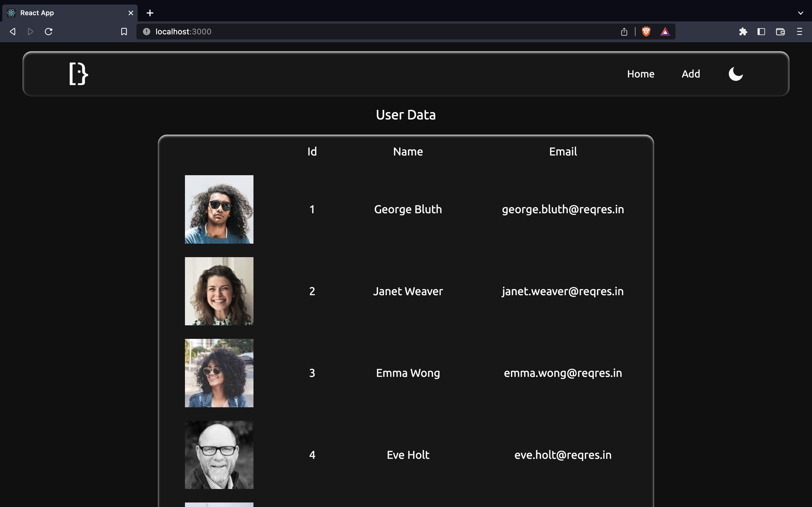
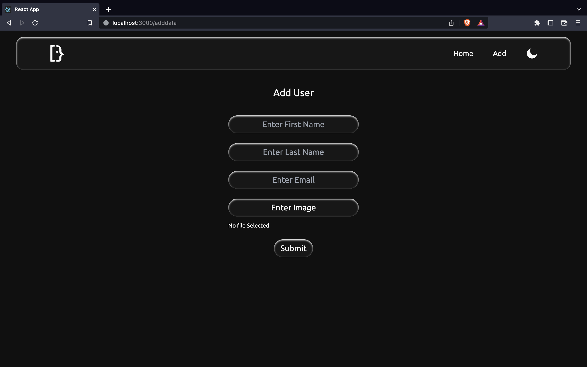
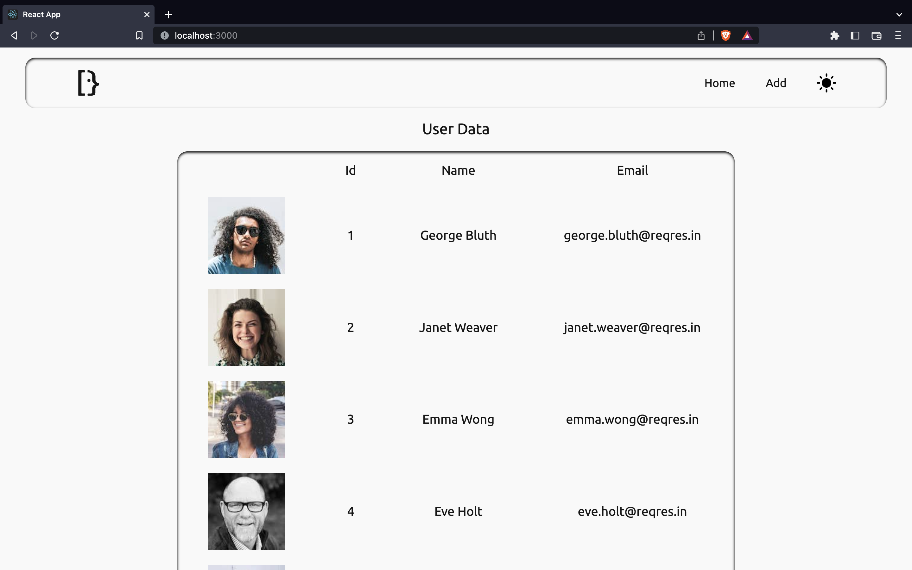
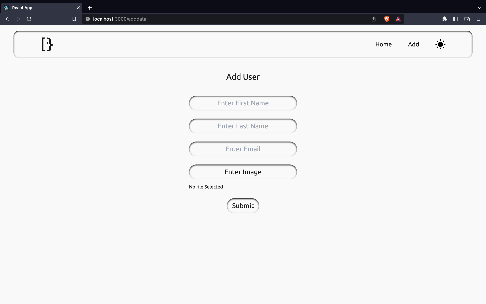

# User Data Table With API

## Packeges

This is main Packages used to make this project

```bash
yarn add axios
yarn add classnames
yarn add concurrently
yarn add json-server
yarn add react-icons
yarn add react-router-dom
yarn add react-toggle-dark-mode
```

## API

```bash
https://reqres.in/api/users/
```

## Output






